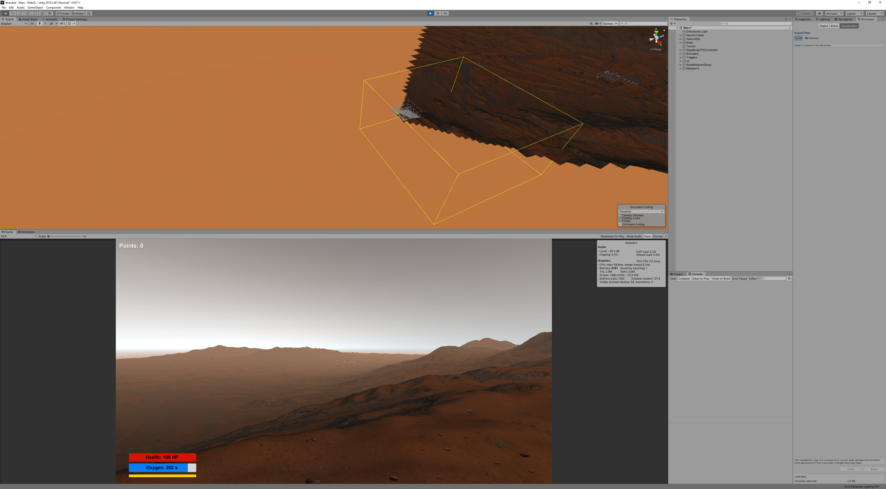

# Stranded peli

* V1.0.0.0 Pre-Alpha Demo  
* TTOS0700 Peliohjelmointi  
* Jyväskylän ammattikorkeakoulu (JAMK)  
* Kevät 2020  
* Julkaistu 26.4.2020  
* Tekijät: Jonne Okkonen (M2235) ja Joonas Niinimäki (M3268)  
* Copyright (C) 

## Sisällysluettelo 

1. [Johdanto](#johdanto)
1. [Pelin Tarina](#pelin-tarina)
1. [Keybinds](#keybinds)
1. [Gameloop](#gameloop)
1. [Peli vs. demo](#peli-vs-demo)
1. [Käytetyt teknologiat](#käytetyt-teknologiat)
1. [Optimointi](#optimointi) 
1. [Ilmaiset resurssit](#käytetyt-teknologiat)
1. [Itsearviointi](#itsearviointi)
1. [Tunnetut bugit](#tunnetut-bugit)

## Johdanto

Stranded peli on sekä FPS, että survival shooter kategorian peli, jossa pelaajan tavoitteena on päästä pelastautumaan vieraalta planeetalta, johon hän on tehnyt pakkolaskun.
Vieraalla planeetalla on mysteerinen tyhjä rakennus ja jokapuolella on outoja tuntemattomia hirviöitä. Pelaajamme on keksittävä tapa päästä planeetalta pois ehjin nahoin. 
Stranded peli on kevään 2020 aikana kehitetty peliprojekti osana TTOS0700 peliohjelmoinnin kurssia. Sen on kehittänyt Jyväskylän Ammattikorkeakoulun kaksi 2. vuoden
ohjelmistotekniikan opiskelijaa Jonne Okkonen (M2235) ja Joonas Niinimäki (M3268).

## Pelin tarina

On vuosi 8 452, ihmiskunta on onnistunut kehittämään planeettojenvälisen avaruusmatkailun ja on nopeasti laajentanut ja kolonisoinut muita mailmoja. Meidän matkaaja oli osana kauppa-saattuetta joka joutui avaruuspiraattien hyökkäyksen kohteeksi ja kaaoksen aikana jolloin kaikki menetettiin, matkaajamme onnistui pääsemään pelastushätäkapseliin ja pakoon. Matkaajamme haaksirikkoutui Marssiin ja on jätetty sinne.

## Keybinds

### Näppäimistö

__W__ = Liiku eteenpäin  
__A__ = Liiku vasemmalle  
__S__ = Liiku taaksepäin  
__D__ = Liiku oikealle  
__Nuoli ylos__ = Liiku eteenpäin  
__Nuoli vasemmalle__ = Liiku vasemmalle  
__Nuoli alas__ = Liiku taaksepäin  
__Nuoli oikealle__ = Liiku oikealle  
__Q__ = Nosta ase näkyville ja laske se pois näkyvistä  
__Vasen hiiren klikkaus__ = Ammu pistoolilla  
__R__ = Lataa ase  
__E__ = Action (Käytä ostoautomaattia/poistu ostoautomaatista/aseta pelastusmajakka) (beacon)  
__Pidä B__ = Osta beacon  
__Pidä M__ = Osta magazine  
__F__ = Paineista ilmalukko  
__Tab__ = Näytä tehtäväruutu  
__LeftShift__ = Juokse  
__X__ = Respawn  

### Xbox Ohjain

__VasenSauva__ = Liiku  
__OikeaSauva__ = Kamera  
__Y__ = Action (Käytä ostoautomaattia/poistu ostoautomaatista/aseta pelastusmajakka) (beacon)  
__B__ = Paineista ilmalukko  
__A__ = Hyppää  
__X__ = Lataa ase/Respawn   
__Pidä OikeaNuoli__ = Osta beacon   
__Pidä VasenNuoli__ = Osta magazine  
__RT__ = Näytä tehtäväruutu  
__RB__ = Ammu pistoolilla  
__LT__ = Juokse  
__LB__ = Nosta ase näkyville ja laske se pois näkyvistä  

## Gameloop

Pelaajalla on rajalliset resurssit käytössään ja hänen tulee miettiä tarkkaan tekemisiään. Pelaajalle on annettu 100 elämäpointtia (Hp = Health point),
happea 300 sekunniksi (s = seconds), staminabaari jossa on rajallimen määrä staminaa jouksemiseksi, sekä pistooli jossa on rajallinen määrä ammuksia.
Näistä ainoastaan stamina latautuu itsestään tietyllä nopeudella, muut resurssit on pelaajan itse haettava tukikohdasta eri toimintoja suorittamalla.

Sitä ennen on pelaajan kuitenkin ensin löydettävä tukikohta ja pistoolinsa avulla hänen on ensin hoidettava tukikohdan ympärillä olevat hirviöt. Sen jälkeen hänen on
vielä löydettävä rikki olevan tukikohdan vialla oleva komponentti ja käydä korjaamassa tämä ennen kuin häneltä loppuu happi ja ammukset. Tämän jälkeen pelaaja saa tukikohdan
käyttöönsä.

Tämän jälkeen pelaaja voi käyttää tukikohtaa niin paljon kuin hän haluaa ja se toimii eräänlaisena ankkurina ja tukipaikkana, jonka kautta pelaaja voi operoida ympäristössään.
Tukikohdasta pelaaja saa aina happipullonsa mittarin täyteen tukikohtaan astuessaan sisään ja paineistamalla ilmalukon ja astumalla sisään tutkikohtaan. Tukikohdassa ikkunan äärellä 
on kasveja, jotka generoituvat ajan kanssa uudelleen ja niitä syömällä pelaaja saa lisää elämäpisteitä jos hän on menettänyt niitä. Tulokulmasta vasemmalla oven vieressä on
ostoautomaatti, jota kautta pelaaja voi ostaa pistoolinsa luoteja ja pelastumiseen vaaditun pelustusmerkkimajakan.

Pelastusmerkkimajakka voidaan ainoastaan kutsua kun pelaaja pääsee tarpeaksi korkealle vuorille ja asettaa majakan rinteelle.
Tämä aloittaa loppuskenaarion, jossa kaikki viholliset agroutuu höykkäämään pelaajaa päin ja pelaajan on selvittävä kunnes pelastusryhmä saapuu ja pelastaa. Selvitessään
loppuskenaarion pelaaja voittaa pelin.

## Peli vs. demo

Tässä osiossa käsitellään pelidemon suunnitelmallisia perusteluita, peliprojektin ratkaisuja ja muita suunnitteluun ja toteutukseen liittyviä asioita.  
Koska kyseessä on pelin demoversio, tarkoitus ei ole suunnitella kaikkia pelin arvoja sellaiseen muotoon, joka julkaisuversiossa olisi. Toisaalta pelattavuuden ja pelin loopin 
sisäiset arvot on pyritty asettamaan sellaisiksi, että niistä näkee jo suoraan pelimekaniikkoja sellaisenaan kuin ne julkaisuversiossa olisi.

Tästä esimerkkinä toimii se ero, että demoversiossa pistoolien lippaiden hinta on suunnitelmallisesti ja tarkoituksella jätetty pieneksi, jotta testaaja pystyy pelaamana pelin
kohtuullisen vaivattomasti läpi. Toisaalta pelaajan omat resurssit, kuten elämäpisteet, happi ja stamina, kuten myös vihollisten tekemä vahinko on laskettu vastaamaan sellaisia 
arvoja, joita ne olisi julkaisuversiossakin.

## Käytetyt teknologiat

### Mekaaninen teknologia

Peliä voi pelata sekä tietokoneen näppäimistöllä, että Xbox-peliohjaimella.

### Pelin teknolgia

Aloitusnäkymässä pelaajan aloitettua pelin ensimmäiseksi pelaaja näkee pelin tarinan alustuksen tekstin ja kuulee narraation sille. Sen jälkeen kun peli alkaa alkuasetelmasta 
hän katsoo hätäpelastuskapselia päin, johon on visuaaliseksi efekteiksi tehty kipinöitä ja lisätty savu-efekti näyttämään hätäkapsulin kohtaamaa vahinkoa pakkolaskun seurauksena.

Pelaaja on käytännössä pelkästään kamera, joka seuraa pelaajan näkymää ensimmäisestä persoonasta ja pelaajaobjekti itse on renderöimätön kapsuli. Painamalla Q-näppäintä pelaaja 
voi nostaa pistoolin näkymäänsä, jolloinka pistooli renderöidään näkyviin ja pois näkyvistä nappia painamalla. Samalla kun pistooli renderöidään näkyviin, pelaajan ruudun
keskelle renderöidään crosshair-tähtäin, jonka mukaan pelaaja voi navigoida tähtäintään ampuakseen kohdetta.

Pelaajan muita UI elementtejä on elämäpisteet, joiden arvot riippuvat pelaajan ottamasta vahingosta, jatkuvasti laskeva happimittari, sekä stamina baari, joista ainoastaan
staminabaari generoi arvoaan itsestään tiettyä vauhtia sen jälkeen kun pelaaja päästää Shfit-näppäimestä irti. Muita pelaajan ja UI:n elementtien arvojen manipulaatiota
käsitellään möyhemmässä vaiheessa tätä osiota.

Peli ohjeistaa pelaajaa reaaliajassa sekä audion avulla, että tabulaattorista saatavalla näytä tehtäväruudulla näppäimellä. Pelitehtävistä peli vielä erikseen ilmoittaa ruudun 
yläkulmalla keskellä, että pelaajalle on tullut uusi tehtävä. Sen ja triggereiden avulla toimivien audio-ohjeistuksen avulla pelaajalle ohjeistetaan mitä hänen tulisi tehdä
edetäkseen pelissä eteenpäin.

Ensimmäisenä tehtävänä pelaajan on löydettävä tukikohta ja pelaajan on ammuttava sen ympäriltä kaikki hirviöt ja koodi käy läpi ja tsekkaa, että pelaaja on onnistuneesti tehnyt
tehtävät kuten pitää ennen seuraavan antamista. Moni toiminto vaatii pelaajalta nappulan pitämistä pohjaan hetken ja pelaaja saa tästä UI:hin näytetyn näppäin-kehotuksen ja
ohjeistuksen tarpeen mukaan. Esimerkiksi asetta ladatessa näytetään ruudulla teksti "reloading...", jotta pelaaja tietää mitä tehdään, ja pelin UI päivittää pelaajan lippaan 
ammusmäärän ja varastossa olevien luotien määrän reaaliaikaisesti näkymässä.

Pelaajan UI näyttää reaaliajassa pelaajalla käytettävät resurssit, joita pelaaja saa lisää tukikohdasta lisää. Happilukema päivittyy samantien kun pelaaja paineistaa
ilmalukon onnistuneesti ja menee sisälle tukikohtaan. Elämäpisteitä pelaaja saa lisää menemällä kasvien luokse, painamalla toimintonäppäintä syödäkseen kasveja. Kun pelaaja 
vuorovaikuttaa ase-objektin kanssa, aseen nostettuaan pelaajalle renderöidään yksinkertainen tähtäin elemenetti UI:hin. Sen lisäksi UI:ssa näkyy oikeassa alakulmassa pelaajan 
lipas (x)-merkin sisällä ja varastossa olevat ammuslukemat sen vieressä.

Pelaaja-hahmo soittaa myös audio-tiedoston joka kerta kuin pelaaja ottaa viholliselta vahinkoa viholliselta. Mikäli pelaaja kuolee, pelaajalle soitetaan kuolemisen
audio-tiedosto ja renderöidään näytölle punainenkuolemis-ruutu ja pelaaja joutuu aloittamaan pelin uudestaan.

Tukikohdan sisällä on myös ostoautomaatti, josta pelaaja voi ostaa lisää pistoolin ammuksia tai pakoon tavittavan pelastusmajakan (beacon). ATM UI renderöidään pelaajalle
toisella kameralla, joka aktivoituu kun pelaaja vuorovaikuttaa ostoautomaatin kanssa ja siihen on lisätty ohjeistus myös sen käytöstä, jotta pelaaja tietää miten ostaa itselleen 
resursseja ja miten poistua ostoautomaatista. Pelastusmajakan (beacon) ostettua pelastusmajakka renderöidään pelaajan UI:ssa indikoimaan, että pelaajalla on nyt se 
objekti mukana. Tukikohdan takahuoneessa oli alunperin erillainen hologrammi kuin Mars joka vaihettiin tilalle
(aihetta käistellään lisää Suunnitellut, mutta hylätyt teknologiat - osiossa).

Metalon vihollishirviöt ovat animoitu kävelemään, hyökkäämään kahdella eri animaatiolla ja kuolemaan riippuen pelaajan ja niiden vuorovaikutuksesta. Niille on tehty kontrolleri, joka mahdollistaa myös
vaihtoehtoisessa maastokorkeudessa liikkumisen suhteellisen sulavasti ja näin pelaaja ei voi hyväksikäyttää maastoa päästäkseen vihollisten ulottumattomiin. Tästä poikkeuksena
on itse tukikohta, jonka katto on erikseen maalattu kulkemattomaksi alueeksi keneltäkään. Jokaiselle Metalonille on annettu eri arvot ja esiintymismäärät, joiden tarkoitus on 
lisätä vihollistyypin monipuolisuutta. Sen lisäksi viholliset agroutuvat pelaajaa päin jos pelaaja tulee tietylle etäisyydelle vihollisista tai pelaaja ampuu vihollista. Kun pelaaja osuu onnistuneesti Metalon viholliseen, niiden osumakohtaan renderöidään vihreä yksinkertainen
veripartikkeli efekti.

Pelastusmajakka (beacon) elementti voidaan ainoastaan laittaa tietyllä korkeudella, eli sen asettamisen UI-kehotetta ei renderöidä ennen kuin peli saa tarkistettua, että pelaaja on 
tarpeaksi korkealla, eikä pelaaja voi vuorovaikuttaa sen objektin kanssa ennen kuin tämä tarkistus palauttaa oikean arvon. Asetettuaan pelastusmajakan peli renderöi sen
peliobjektin kentälle ja se alkaa renderöimään signaalia indikoivia sinisiä renkaita (Huom: Katso bugi-osiossa lisätietoja). Samalla pelaajan alle tulee valokeila indikoimaan pelastusaluksen saapumista. Kun pelaaja pelastuu 
pelaajan objekti alkaa nousemaan ylöspäin ja pelaajalle renderöidään voittonäkymä.

Liikkumisaluetta on rajattu näkymättömien seinien avulla niin, että pelaaja ei voi vahingossakaan liikkua pelimaailman ulkopuolelle ja tippua ulos pelikentästä.
Lisäksi rajaus on asetettu niin, että se ei kata koko kenttää, jotta se luo hieman sellaista illuusiota, ettei pelaaja kävelekkään vain pienellä maaston keinotekoisella
saarella vaan planeetan näkymä jatkuu horisonttiin. Näin luodaan isomman maailman illuusiota.

## Suunnitellut, mutta hylätyt teknologiat.

Tässä dokumentissa käsitellään teknologioita ja ominaisuuksia, joita projektille oli suunniteltu, mutta ei toteutettu.

- Pelaaja-hahmolle renderöidään punainen välähdysruutu joka kerta kun hän ottaa vahinkoa. Ratkaisuksi päädyttiin toisenlaiseen toteutukseen.
- Punainen Metalon vihollinen voisi ampua projektilejä, joilla olisi oma partikkeliefektinsä, tarkkuus ja matkustusaika (ei hitscan). Koodilogiikka oli suurimmaksi osaksi jo
tehty, mutta ominaisuus jätettiin lopullisesta demosta pois ajanpuutteen takia.
- Vihollisilla olisi random-alue spawneri, joka loisi lisää vihollisia randomiin kohtiin alueessa kun tsekkaus huomaisi niiden lukeman olevan tarpeeksi pieni.
- Beaconin ympärille renderöitäisiin alue jonka sisällä tämän olisi pysyttävä voittaakseen pelin. Toteutuksessa päädyttiin toiseen ratkaisumalliin.
- Loppuskenaariossa luotaisiin lisää vihollisia. Ratkaisu hylättiin tarpeettomana lisänä (ottaen huomioon muut ominaisuudet ja suunnitellut ominaisuudet).
- Tukikohdan kasvit tuhottaisiin hetkellisesti ja renderöitäisiin takaisin tietyn aikajakson jälkeen (kasvit tarvitsevat aikaa kasvaa). Hylättiin ajanpuutteen takia.
- Pelastusmajakka (Beacon) voitaisiin ampua miltä korkeudelta vain, mutta voittaakseen pelaajan pitäisi ampua se tarpeaksi korkealta ja ensimmäisen kerran epäonnistuessa toinen
maksaisi enemmän. Ominaisuuden todettiin olevan epäedullinen pelattavuudelle, eikä se tuonut lisäarvoa pelimekaanisesti.
- Tukikohdan takahuoneelle renderöity Mars planeetta hologrammi oli suunniteltu läpikuultavaksi. Tätä yritettiin tehdä useammalla ratkaisulla epäonnistuneesti ja se hylättiin 
epäolennaisuuden ja ajanakäytön vaatimuksen perusteella (ei siis ollut järkeä käyttää siihen niin paljoa aikaa).

## Optimointi

Peli on optimoitu asettamalla liikkumattomat objectit staattisiksi sekä beikkaamalla staattisten objection valaistus, näiden lisäksi peliin on beikattu Occlusion Culling eli pelirenderöidään vain kameran näkökentästä (katso alla oleva kuva). Erinäisiä partikkeliefektejä on muokattu ja testattu niin, ettei ne ole olisi liian raskaita renderöidä ja ettei ne vaikuttaisi merkittävän negatiivisesti pelattavuuteen. Myös muutamiin kohtiin on tehty näkymättömiä objekteja, jotka estävät pelaajaa jumittautumasta kokonaan ja jotka on aseteltu kuitenkin niin, ettei pelaaja näe ja tunnista eroa avaruudellisesti.

Peliä ei ole optimoitu eri laitteistoille ja sen on todettu olevan aika raskas pyörittä varsinkin kokonaisuudessaan pienempitehoisilla tietokoneilla (testattu). Sen sijaan
tarkkoja speksien arvoja ei ole testeissä voitu selvittää. Tämä osittain testattavien laite - ja siihen liittyvien resurssien puutteen takia, ja osittain aikapuutteenkin takia.

Projektille on suoritettu manuaalista testaamista vain pelaamisen tasolla. Suurempia testejä ei ole laadittu, eikä niitä ollut projektiin vaadittu. Pääasia, että suurimmat bugit on korjattu ja peliä optimoitu. 

OcclusionCulling Demo

## Ilmaiset resurssit

__Ilmaisten resurssien kirjasto:__

* [Metalon hirviö](https://assetstore.unity.com/packages/3d/characters/creatures/meshtint-free-polygonal-metalon-151383)
* [Mars](https://assetstore.unity.com/packages/3d/environments/landscapes/mars-landscape-49808)
* [Tukikohta](https://assetstore.unity.com/packages/3d/environments/sci-fi/sci-fi-styled-modular-pack-82913)
* [Pistooli](https://assetstore.unity.com/packages/3d/props/guns/sci-fi-gun-162872)
* [Avaruusalus](https://assetstore.unity.com/packages/3d/props/guns/sci-fi-gun-162872)
* [Avaruusaluksen savu-efekti](https://assetstore.unity.com/packages/vfx/particles/white-smoke-particle-system-20404)
* [ATM ostoautomaatti](https://assetstore.unity.com/packages/3d/environments/sci-fi/atm-95057)
* [Text-to-speech NaturalReaders-sivu](https://www.naturalreaders.com/online/)

## Itsearviointi

### Jonne Okkonen (M2235)

### Joonas Niinimaki (M3268)

Itse ehdottaisin arvosanaa 5. Tämä projekti on ollut mielekästä tehdä ja siihen on tullut panostettua heposti yli +30 tuntia.
Projektissa vastasin suurimmaksi osaksi vihollisa, niiden statseista, liikkumisesta, hyökkäämisestä ja teoälystä. sen lisäksi tein osan pelaajan statseista ja interaktiivisuudesta
kuten elämän logiikan ja osan Ui elementteistä pelaajahahmolle (kuten elämäbaari ja stamina). Sen lisäksi loin suurimman osan partikkeliefekteistä lisäämään pelille enemmän yksityiskohtaisuutta.
Olin myös vastuussa tarinanluonnista ja dialogeista mitä pelaajahahmo sanoisi missäkin tilantessa ja ATM mainospätkä.

Beikkasin myös kuljettavan alueen niin, ettei siinnä tule 
vihoillisten tekoälylle kulkemattomia alueita, tästä poikkeuksena tukokohdan katto jonka maalasin kulkemattomaksi alueeksi. omaksi harmikseni aikaa ei jäänyt vielä toteuttaa
punaisen vihollistyypin ampuvan projektileä. Skriptilogiikka oli jo tehty, enää olisi pitänyt tehdä tälle projektile partikkeli ja logiikka projektilelle niin, että
siinnä olisi matkustusaikaa ja pelaaja voisi väistää sen, eikä se olisi hitsan ollut. Projektista jäi hyvä fiilis loppuun, paljon ideoita joita vielä haluaisimme toteuttaa ja
pelikurssi on ollut kokonaisuudessaan mukava, opettavainen ja kiinnostava.

## Tunnetut bugit

Tässä osioissa dokumentoidaan peliprojektissa tunnistetut bugit:

* Beaconille on luotu animaatio ja sininen rinkulaefekti. Mutta Web GL-versiossa jostain vielä tunnistamattomasta syystä viimeisen kahden buildin aikana se lopetti niiden
renderöinnin ja aikaa tarpeelliselle korjaamiselle ei enää niin loppuvaiheessa ollut. Se toimii oikein standalone versiossa.
* Pelaaja-objekti voi joskus jäädä jumiin eri elementteihin pelikentällä ja siitä pääsee irti hyppimällä. Syyksi on tunnistettu yleinen Unityssa kohdattu ongelma, mutta 
korjausratkaisua ei ollut keritty selvittämään.
* On pieni mahdollisuus, että Metalon vihollinen voi hyökätessään työntää pelaajan pelikentän läpi. Ratkaisua ei keretty tutkimaan.
* Kun pelaaja menee fabrikaattorille (ATM) ostamaan panoksia, lippaan panoksien määrä UI elementin mukaan nollautuu vaikka ne ovat kyllä vielä lippaassa ja pelaaja voi ampua. 
Ne renderöityy takaisin oikeaan tilaan lataamalla ase R-näppäimestä. Vika on tunnistettu olevan aseen renderöintilogiikan ongelma, ja ratkaisuna pitäisi sitä muuttaa.
* Kun pelaaja ostaa beaconin, tukilohdan ovien promptit eivät renderöidy. Tämä johtuu siitä, että ne käyttävät samaa UI elementtiä.